# ROOT.WORKS — Game Wiki & Engineering Manual

> **Version**: Current | **Authors**: ROOT.WORKS Engineering Team
>
> This is the official systems engineering manual for ROOT.WORKS. It covers every major system in the game — from early hand-crafting through quantum antimatter synthesis — with detailed graphs, progression charts, and operational guides.

---

## Table of Contents

1. [Keyboard Controls, Console Commands, & Shortcuts](#1-keyboard-controls-console-commands--shortcuts)
2. [Logistics & Fluid Conduit Infrastructure](#2-logistics--fluid-conduit-infrastructure)
3. [Technology & Progression Stages](#3-technology--progression-stages)
4. [Machines & Crafting Reference](#4-machines--crafting-reference)
5. [Digital Data Grid (AE-Style Automation)](#5-digital-data-grid-ae-style-automation)
6. [Programmable Logic Controllers (PLC) Scripting](#6-programmable-logic-controllers-plc-scripting)
7. [Drone Automation Systems](#7-drone-automation-systems)
8. [Rail Transport & Train Logistics](#8-rail-transport--train-logistics)
9. [Advanced Reactor Engineering & High-Yield Power](#9-advanced-reactor-engineering--high-yield-power)
10. [Industrial Hazards & Critical System Failures](#10-industrial-hazards--critical-system-failures)
11. [Survival Mechanics](#11-survival-mechanics)

---

## 1. Keyboard Controls, Console Commands, & Shortcuts

### General Movement & Interaction

| Action | Key |
|:---|:---|
| Move | `W` `A` `S` `D` or Arrow Keys |
| Sprint | Hold `SHIFT` |
| Mine / Harvest tile | Hold `F` |
| Open Player Inventory | `E` |
| Open Machine Interface | **Right-Click** on machine |
| Build Menu | `B` |
| Hand Crafting / Table Menu | `C` |
| Equipment & Usables | `U` |
| Guide & Controls | `G` |

### Building & Placement

| Action | Key |
|:---|:---|
| Click to queue placement | Left Click (in build mode) |
| Drag to place continuous pipes | Hold Left Click and drag |
| Rotate blueprint | `R` |
| Cycle pipe shape | `T` |
| Open network directory | `M` |
| Confirm placement queue | `Enter` |
| Cancel / exit mode | `ESC` |

> **Tip**: When placing pipes, dragging creates straight runs. If you drag perpendicular to your current direction, the game auto-inserts a corner joint (like Logisim wire routing), letting you draw L-shaped pipe runs in one motion.

### Routing Pipes

| Action | Key/Action |
|:---|:---|
| Enter routing mode | `L` |
| Click start tile | Left Click on a pipe tile |
| Click end tile | Left Click on destination pipe tile |
| Cancel routing | `ESC` |

The blue highlight box shows where your mouse cursor currently sits in tile-space. The game runs A* pathfinding along existing pipe networks to find and create the route.

### Advanced / Admin

| Action | Key |
|:---|:---|
| Open console | `/` |
| Database dump to clipboard | `SHIFT + J` |
| Save game | `SHIFT + O` |
| Load game | `SHIFT + L` |
| Toggle Creative Mode | `SHIFT + ;` or `SHIFT + :` |
| Toggle Agent Mode | `CTRL + SHIFT + Y` |
| Toggle Agent Recording | `CTRL + SHIFT + Z` |

### Console Commands

```
/give <item_id> <quantity>      — Spawn item in inventory
/give all                       — Add every item & machine to inventory
/tick rate <multiplier>         — Speed up/slow down simulation (e.g. /tick rate 5.0)
/tick rate default              — Reset to normal speed
```

---

## 2. Logistics & Fluid Conduit Infrastructure

All item and fluid transport uses dedicated pipe networks. Each network only carries specific materials — you cannot route coal through a copper water pipe, or steam through a glass gas pipe. Ports on machines are colour-coded to match their compatible network.

### Conduit Network Reference

| Network | Pipe Item | Color | Carries | Heavy Variant? |
|:---|:---|:---|:---|:---|
| **Item** | `item_pipe` | Dark Grey `#424242` | Solid items (ores, components, plates) | Yes (`item_pipe_heavy`, 12/tick) |
| **Iron** | `iron_pipe` | Red `#f44336` | Molten Lava | No |
| **Copper** | `copper_pipe` | Light Blue `#03a9f4` | Water, Brine, Heavy Water | No |
| **Brass** | `brass_pipe` | Yellow `#fbc02d` | Steam | Yes (`brass_pipe_heavy`) |
| **Glass** | `glass_pipe` | Cyan `#00bcd4` | Oxygen, Hydrogen, Nitrogen, Petroleum Gas, Sulfur Dioxide, Chlorine, Unrefined Gas | No |
| **Lead Lined** | `lead_lined_pipe` | Lime Green `#8bc34a` | Sulfuric Acid | No |
| **Steel** | `steel_pipe` | Slate Grey `#90a4ae` | Crude Oil, Semi-Refined Oil, Heavy Oil, Light Oil, Naphtha, Liquid Plastic | No |
| **Insulated** | `insulated_pipe` | Dark Blue `#1565c0` | Liquid Nitrogen, Hot/Superheated Nitrogen | No |
| **Gold-Lead** | `gold_lead_pipe` | Crimson `#c51162` | Nuclear Waste | No |
| **Plasmatic** | `plasma_conduit_pipe` | Orange `#ff6d00` | Raw Plasma, Stabilized Plasma | No |
| **Magnetic** | `magnetic_containment_pipe` | Deep Purple `#aa00ff` | Positron Streams, Antiprotons | No |

### Pipe Flow Rules

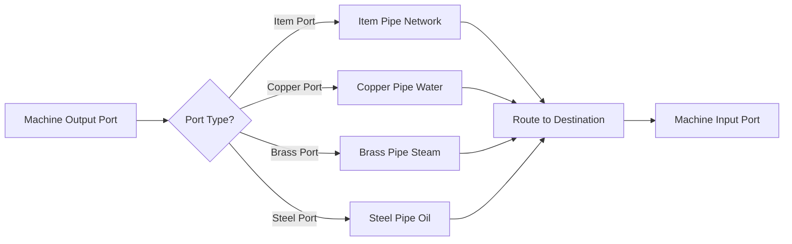

### Item Transport: Ticks & Throughput

Items on pipes move in discrete **belt ticks** (every 0.5 seconds). Normal item pipes carry **1 item per tick** (2/sec). Heavy item pipes carry **12 items per tick** (24/sec).

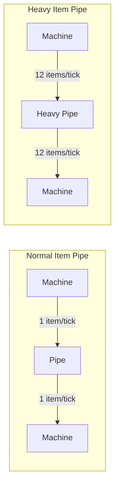

> **Backpressure**: If a destination machine's input buffer is full (at `maxStack`, default **100** items per slot), items stop at the last pipe tile and back up the entire route, blocking further delivery until space opens.

### Machine Input Stack Limits (maxStack)

| Machine Category | Default maxStack |
|:---|:---|
| Processing machines (furnaces, assemblers, etc.) | **100** |
| Storage boxes | **10,000** |
| Large storage chests | **2,000** |
| Fluid / Gas tanks | **5,000** |
| Digital storage | **50,000** |
| Splitters, filters | **5** |

### Junction & Corner Geometry

All conduits use the indexed shape library `LOGISTICS_SHAPES`:

| Shape | Character | Use |
|:---|:---|:---|
| Straight horizontal | `─` | Linear horizontal flow |
| Straight vertical | `│` | Linear vertical flow |
| Corner NE/NW/SE/SW | `└` `┌` `┐` `┘` | 90-degree bends |
| T-junction | `┬` `┤` `┴` `├` | Split or merge flows |
| Cross intersection | `┼` | Full cross-connection |
| Heavy/reinforced | `━` `┃` | Heavy pipe variants |
| Double-line hazardous | `═` `║` | Acid, SiCu, and Hyper Wire |

### Pipe Routing Example

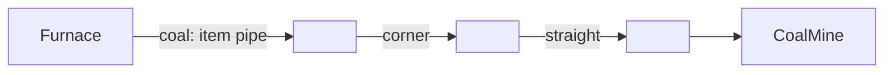

---

## 3. Technology & Progression Stages

The factory is designed across **8 distinct industrial eras**. Each stage builds on the last and requires its output to unlock the next.


---

### Stage 1 — Primitive Tools & Hand Logistics

**Goal**: Bootstrap a basic food, water, and material supply chain entirely by hand.

**Key activities**: Chop logs, harvest fiber and stone, till and plant farmland, hand-craft basic tools.

| Machine | Role |
|:---|:---|
| `machine_crafter` | Crafting Table — unlocks structural & tool recipes |
| `machine_manual_grinder` | Hand-mills wheat into flour |
| `machine_manual_mixer` | Mixes flour + water into dough |

---

### Stage 2 — Steam & Kinetic Transmission

**Goal**: Replace hand labor with coal-fired steam engines and kinetic gear trains.

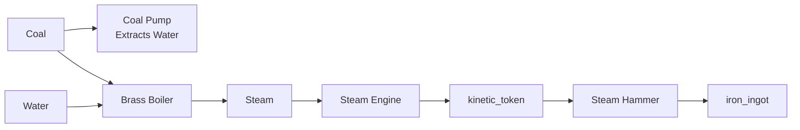

| Machine | Role |
|:---|:---|
| `machine_coal_pump` | Extracts water using coal |
| `machine_brass_boiler` | Converts water + coal → steam |
| `machine_steam_engine` | Converts steam → kinetic_token |
| `machine_steam_hammer` | Forges puddled iron → iron_ingot |
| `machine_bronze_gear_miller` | Cuts plates into gear components |

---

### Stage 3 — Electrification & Solid Chemistry

**Goal**: Build the first electrical power grid using coal generators and begin alloying.

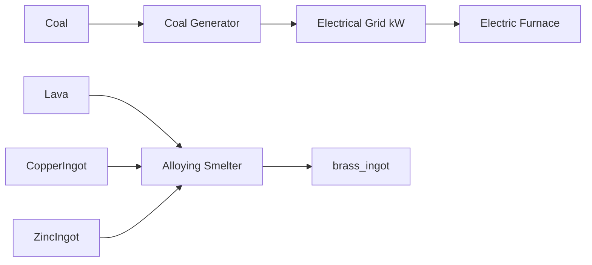

| Machine | Role |
|:---|:---|
| `machine_generator` | Coal → electrical energy |
| `machine_magmaeous_crucible` | Stone + coal → lava |
| `machine_alloying_smelter` | Lava-powered alloy smelting (Brass, Bronze) |
| `machine_furnace_electric` | Efficient electric ore smelting |
| `machine_assembler` | Automated multi-input crafting |

---

### Stage 4 — Petrochemical & Hydrocarbons

**Goal**: Establish an oil extraction and multi-stage refining chain to produce plastics and fuels.

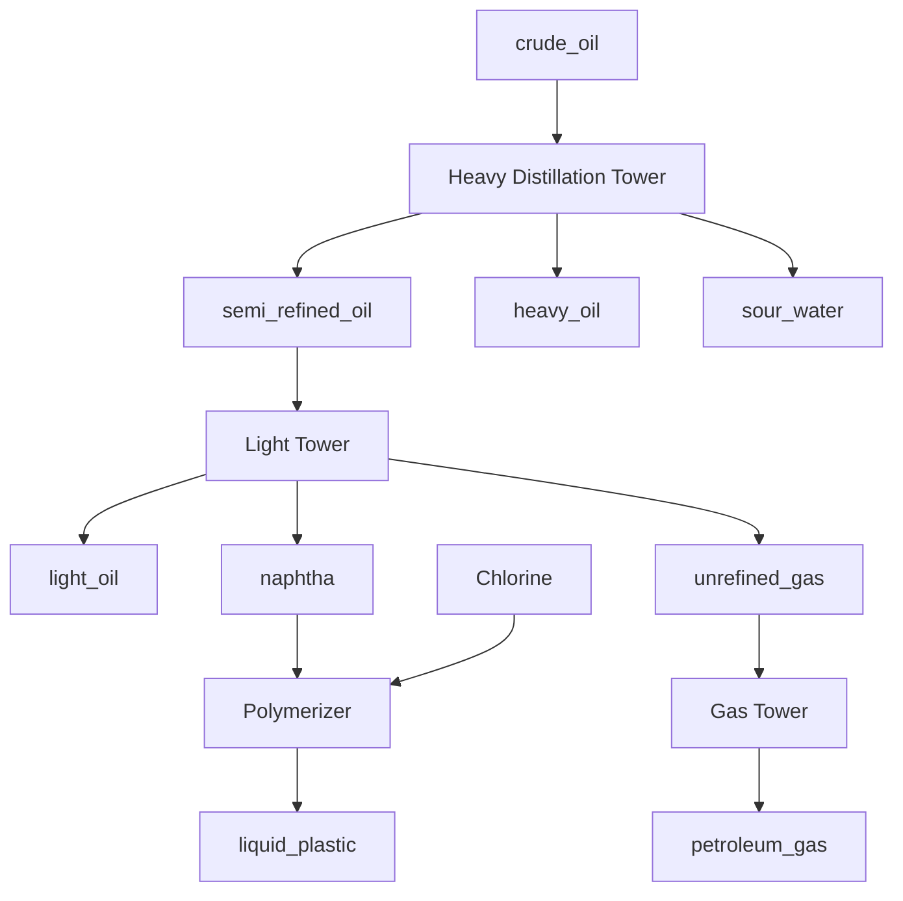

| Machine | Role |
|:---|:---|
| `machine_pumpjack` | Extracts crude_oil |
| `machine_heavy_tower` | Distills crude into fractions |
| `machine_light_tower` | Isolates light oils & naphtha |
| `machine_gas_tower` | Isolates gases |
| `machine_chemical_mixer` | Produces sulfuric_acid |
| `machine_polymerizer` | Naphtha + Chlorine → liquid_plastic |

---

### Stage 5 — Semiconductors & Photolithography

**Goal**: Purify sand through a 7-stage pipeline into single-crystal silicon, then fabricate integrated circuits.


> **HEPA Containment**: The `machine_czochralski_puller` and `machine_lithographer` require a `machine_hepa_purifier` within **13x13 tiles** (6 block radius). Without it, they refuse to operate.

| Machine | Role |
|:---|:---|
| 7-stage pipeline | Produces `pure_silica` from raw sand |
| `machine_czochralski_puller` | Pulls silicon crystal ingot |
| `machine_wafer_saw` | Slices ingots into raw wafers |
| `machine_wafer_polisher` | Polishes for lithography |
| `machine_stencil_press` | Punches metallic IC masks |
| `machine_lithographer` | UV exposure → CPU/RAM/GPU ICs |
| `machine_hepa_purifier` | Cleanroom air scrubber |

---

### Stage 6 — Nuclear Fission Core Infrastructure

**Goal**: Process radioactive ores into enriched fuel rods and run a water-cooled fission reactor.

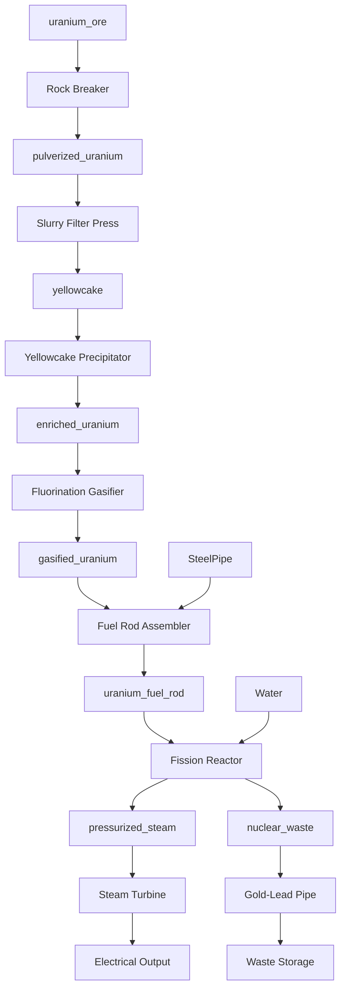

---

### Stage 7 — Fusion & Plasma Containment

**Goal**: Achieve self-sustaining plasma fusion for massive power output.

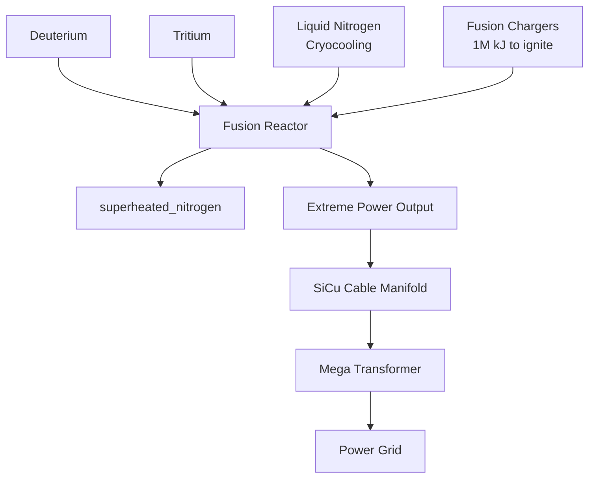

| Machine | Role |
|:---|:---|
| `machine_particle_collider` | Synthesizes Deuterium & Tritium |
| `machine_cryocooler` | Nitrogen gas → Liquid Nitrogen |
| `machine_primitive_plasma_tap` | Siphons raw plasma |
| `machine_plasma_manifold` | Raw Plasma + Water → stabilized_plasma |
| `machine_mhd_generator` | Stabilized Plasma → electricity |
| `machine_fusion_reactor` | D + T → extreme power |

---

### Stage 8 — Quantum & Antimatter Synthesis (End-Game)

**Goal**: Synthesize antimatter, maintain ontological stability, and manufacture pseudo-matter alloys.

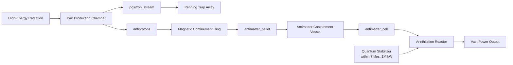

---

## 4. Machines & Crafting Reference

### Ore Smelting Chart

All standard ores can be smelted in both the coal and electric furnace:

| Ore | Output Ingot | Notes |
|:---|:---|:---|
| `iron_ore` | `iron_ingot` | Chance to produce `ash` (20%) in coal furnace |
| `copper_ore` | `copper_ingot` | — |
| `zinc_ore` | `zinc_ingot` | — |
| `tin_ore` | `tin_ingot` | — |
| `lead_ore` | `lead_ingot` | — |
| `gold_ore` | `gold_ingot` | — |
| `aluminium_ore` | `aluminium_ingot` | — |
| `titanium_ore` | `titanium_ingot` | — |

### Alloying Chart

| Inputs | Output | Machine |
|:---|:---|:---|
| `copper_ingot` + `zinc_ingot` | `brass_ingot` x2 | Alloying Smelter (lava) |
| `copper_ingot` x3 + `tin_ingot` | `bronze_ingot` x4 | Alloying Smelter (lava) |
| `iron_ingot` + `coal` | `steel_ingot` | Steel Converter |

### Power Generation Summary

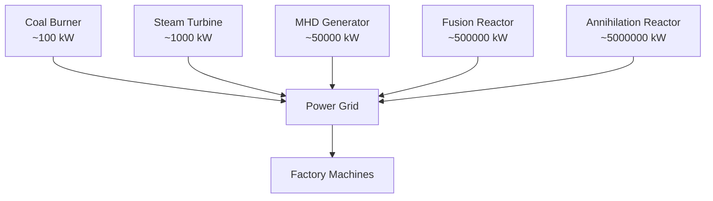

---

## 5. Digital Data Grid (AE-Style Automation)

The **Digital Data Grid** centralizes all storage into one indexed virtual inventory accessed over **Quartz Data Cables**. Physical items and fluids are digitized on import and re-materialized on export.

### Network Topology

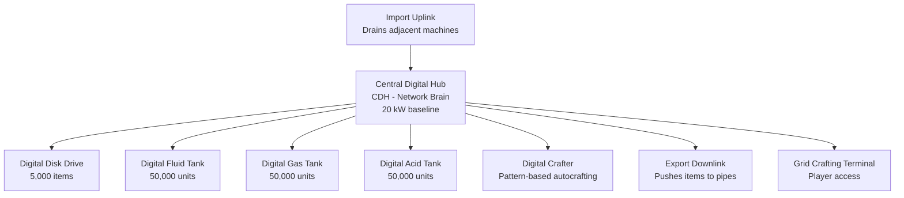

### Digital Grid Infrastructure

| Component | Function |
|:---|:---|
| **Central Digital Hub (CDH)** | Master routing brain — scans storage, prioritizes imports/exports, coordinates crafters. Requires 20 kW. |
| **Digital Disk Drive** | Stores up to 5000 solid items |
| **Digital Fluid Tank** | Stores 50000 units: Water, Lava, Brine, Heavy Water, Sour Water |
| **Digital Gas Tank** | Stores 50000 units: Steam, Oxygen, Hydrogen, Nitrogen, Liquid Nitrogen, Chlorine |
| **Digital Acid Tank** | Stores 50000 units: Sulfuric Acid |
| **Import Uplink** | Auto-drains adjacent physical buffers into digital storage |
| **Export Downlink** | Continuously pulls items from digital storage into pipes |
| **Digital Exporter** | Scans machine in front of its port, extracts products to CDH |
| **Grid Crafting Terminal** | Manual view + retrieval of all digital items; request crafting jobs |

### Automated Crafting Jobs

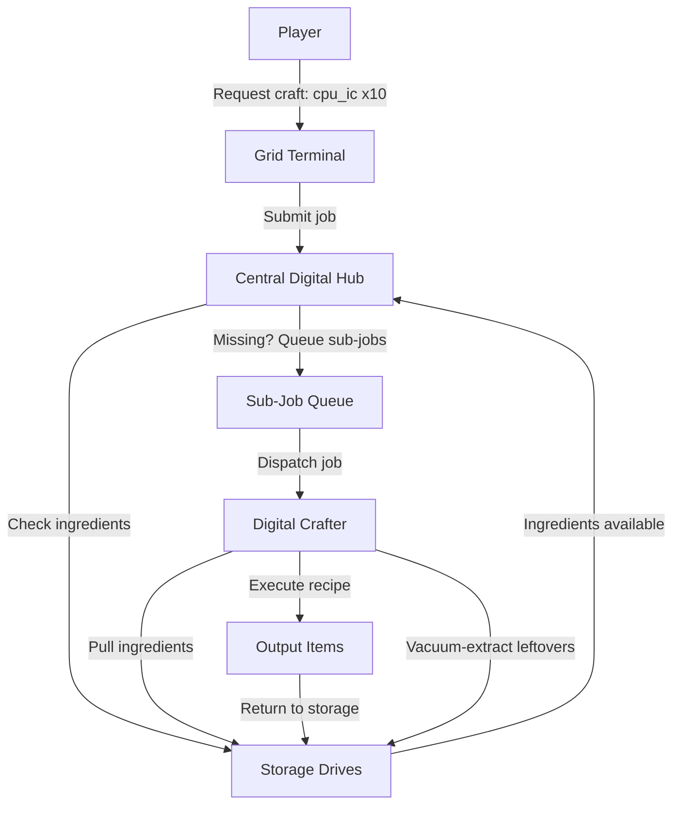

**Rules:**
1. **Pattern Matching**: Define input/output patterns in the Digital Crafter terminal.
2. **Sub-Job Chaining**: Missing ingredients with registered sub-patterns are queued automatically.
3. **Space Pre-Check**: CDH verifies output storage capacity before starting. Full storage = job on standby.
4. **Vacuum Extraction**: Leftover ingredients from cancelled or completed jobs return to storage automatically.

---

## 6. Programmable Logic Controllers (PLC) Scripting

A **PLC Logic Processor** connected via Quartz Data Cables compiles your script into an AST and runs it every simulation cycle. It communicates via input/output nodes, never touching the world directly.

### I/O Node Types

| Node | Function |
|:---|:---|
| `machine_gp_input` | Reads digital storage metric or power grid value → PLC channel |
| `machine_gp_output` | Receives PLC channel value → broadcasts signal |
| `machine_pgp_input` | Reads physical machine metric (aligned via port) → PLC channel |
| `machine_pgp_output` | Pushes PLC channel value → enables/disables adjacent machine |

### PLC Signal Flow

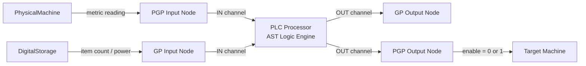

### Monitorable PGP Variables

| Variable | Returns |
|:---|:---|
| `energy` | Current energy buffer |
| `heat` / `temperature` | Internal temperature (K) |
| `timer` / `progress` | Current process timer value |
| `enabled` | 1 = running, 0 = disabled |
| `fuelTime` | Remaining burn time of active fuel |
| `waste` | Total nuclear waste in machine buffers |
| `<item_id>` / `item:<item_id>` | Exact item count in machine inventory |

### PLC Language Syntax

```pascal
// Variable assignment
variable = value

// Conditional
IF <condition> THEN
    // code
ELSE
    // code
ENDIF

// Read input channel
variable = IN(channel_index)

// Write output channel
OUT(channel_index) = value

// Operators: > < >= <= == != + - * /
```

### Example Scripts

#### Battery-Saving Backup Generator

Monitors battery storage on Channel 0. Enables a backup coal generator (Channel 1) when power drops below 5,000 kJ; disables it above 75,000 kJ.

```pascal
power = IN(0)

IF power < 5000 THEN
    OUT(1) = 1
ENDIF

IF power > 75000 THEN
    OUT(1) = 0
ENDIF
```

#### Fission Reactor Thermal Cutoff

Reads core temperature (Channel 2) and water reserves (Channel 3). Cuts the reactor (Channel 4) if overheating or coolant-starved.

```pascal
temp = IN(2)
water_reserves = IN(3)

IF temp > 8500 THEN
    OUT(4) = 0
ELSE
    IF water_reserves < 5 THEN
        OUT(4) = 0
    ELSE
        OUT(4) = 1
    ENDIF
ENDIF
```

#### Digital Storage Overflow Guard

Shuts off an Import Uplink (Channel 5) when digital storage exceeds 90% capacity, preventing network flood.

```pascal
stored = IN(0)
capacity = 5000

IF stored > 4500 THEN
    OUT(5) = 0
ELSE
    OUT(5) = 1
ENDIF
```

---

## 7. Drone Automation Systems

Drones extend your logistics reach for tasks that pipes cannot handle — particularly mid-game farming and bulk carrier operations.

### Drone Types

| Station | Color | Role |
|:---|:---|:---|
| `machine_drone_station_farming` | Green `#8bc34a` | Autonomously farms crops in a designated rectangular region |
| `machine_drone_station_carrier` | Orange `#ff9800` | Transports items between a Drone Input and Drone Output node |

### Carrier Drone Flow

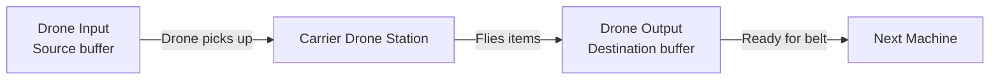

### Farming Drone Flow

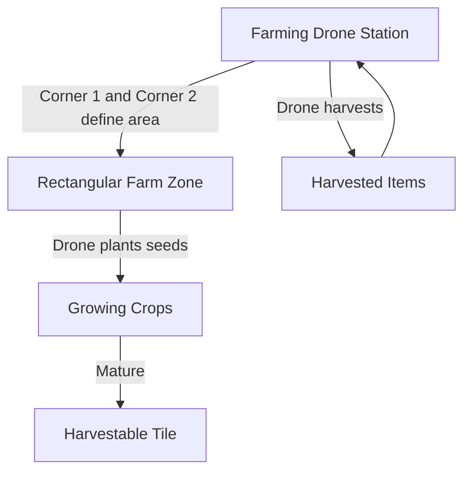

### Routing Drone Networks

Drone networks use their own routing type (`drone_farm` or `drone_carrier`). Use routing mode (`L`) and select the drone network type to define:
- **Farming**: Station → Corner 1 → Corner 2 (defines rectangular farm area)
- **Carrier**: Station → Drone Input → Drone Output

---

## 8. Rail Transport & Train Logistics

When pipe networks become impractical for long-distance transport, the automated rail system moves bulk cargo across the map.

### Train System Architecture

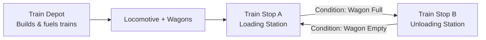

### Rolling Stock

| Vehicle | Capacity | Notes |
|:---|:---|:---|
| **Locomotive** | — | Requires coal fuel; lead engine of a train |
| **Cargo Wagon** | 500 solid items | Ores, components, plates |
| **Fluid Wagon** | 2,000 fluid units | Water, oil, acids, gases |

### Train Station Components

| Component | Function |
|:---|:---|
| **Train Stop** | Addressable station; set name via terminal (e.g. `IRON_OUTPOST_1`) |
| **Train Depot** | Deploys trains; auto-transfers coal to docked locomotive fuel boxes |

### Schedule Departure Conditions

| Condition | Behavior |
|:---|:---|
| `wait_full` | Train waits until all wagons are 100% loaded |
| `wait_empty` | Train waits until all wagons are fully unloaded |
| `wait_timer: N` | Train departs after N seconds at station |
| `wait_inactivity: N` | Train departs if no load/unload activity for N seconds |

---

## 9. Advanced Reactor Engineering & High-Yield Power

### Water-Cooled Fission Reactor

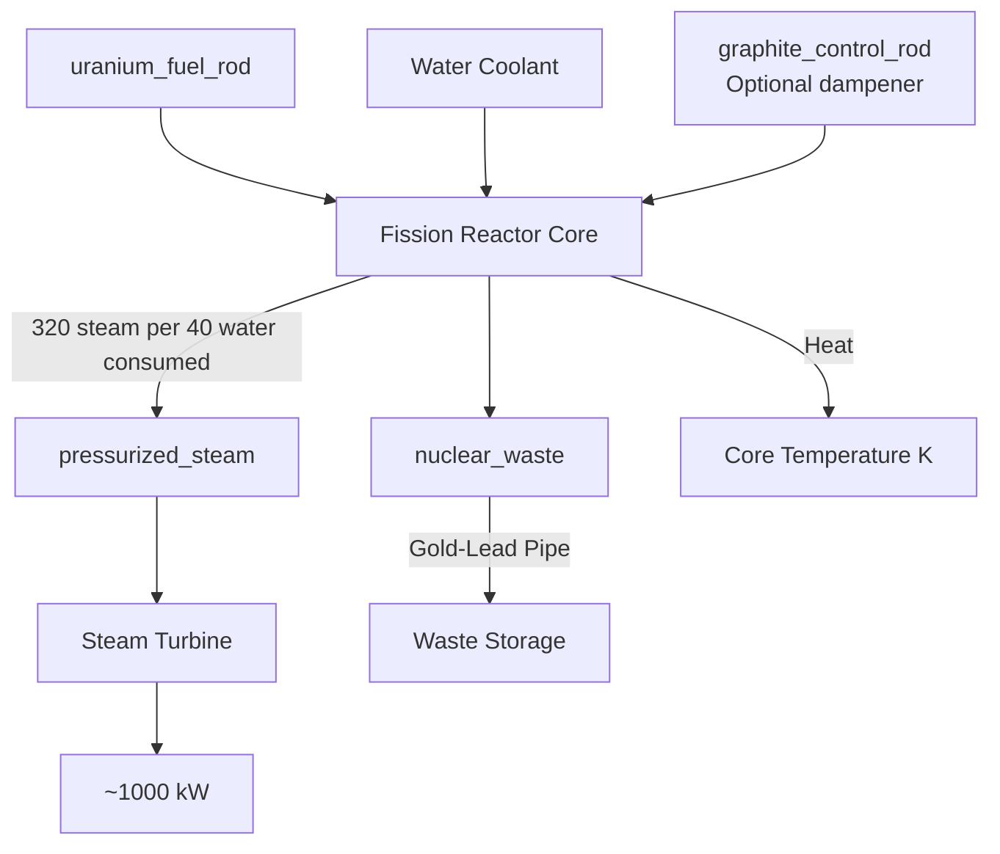

**Thermal dynamics:**

| Event | Heat Effect |
|:---|:---|
| Uranium fuel rod active | +300K per second |
| Graphite control rod inserted | Reduced to +25K per second |
| 40 water units consumed | -200K |
| Waste output buffer full | +500K per second (uncoolable) |
| Core reaches 10,000K | **MELTDOWN** |

### Plasma-Pinched Fusion Reactor

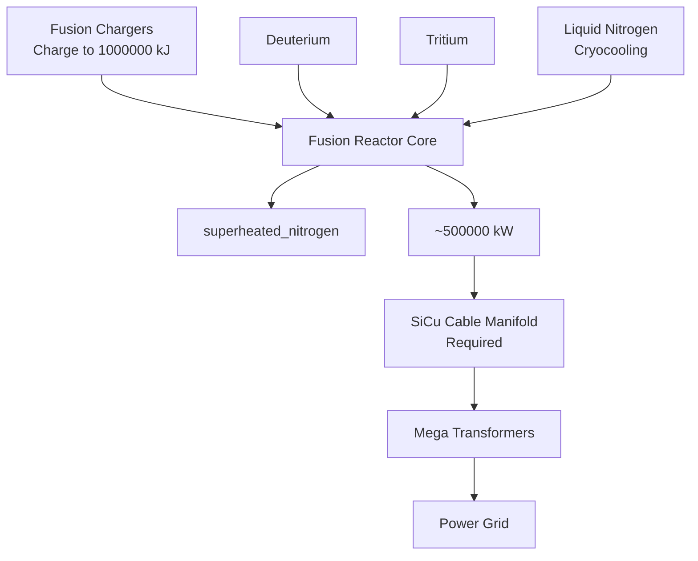

**Thermal dangers:**

| Event | Heat Effect |
|:---|:---|
| Liquid Nitrogen below 10 units/cycle | +50,000K per second |
| SiCu cable manifold broken/missing | +100,000K per second |
| Core reaches 500000K | **SUPERNOVA COLLAPSE** |

### Annihilation Reactor (End-Game)

```mermaid
flowchart TD
    AntimatterCell[antimatter_cell] --> Annihilator[Annihilation Reactor]
    Matter --> Annihilator
    QStabilizer["Quantum Stabilizer<br/>Within 7 tiles<br/>1M kW"] --> Annihilator
    Annihilator --> VastPower["~5000000 kW"]
    Annihilator --> OntologicalIndex["Ontological Stability Index<br/> 0% = REALITY COLLAPSE"]
```

**Stability rules:**
- Must have an operational `machine_quantum_stabilizer` within **7 tiles**
- Stabilizer requires **1,000,000 kW** constant
- If stabilizer goes offline: index drops **15% per second**
- Index reaches 0% → **Paradoxical Reality Collapse** (see Section 10)

### Power Tier Comparison

```mermaid
graph LR
    CoalGen["Coal Generator<br/>~100 kW"] --> Mid["Mid-Tier<br/>Steam Turbine<br/>~1000 kW"]
    Mid --> High["High-Tier<br/>MHD Generator<br/>~50000 kW"]
    High --> Fusion["Fusion Reactor<br/>~500000 kW"]
    Fusion --> Annihilation["Annihilation Reactor<br/>~5000000 kW"]
```

---

## 10. Industrial Hazards & Critical System Failures

Operating high-tier machinery carries serious risks. Neglect cooling, control systems, or stability and your factory — or reality itself — pays the price.

### Hazard Severity Overview

```mermaid
graph TD
    PlasmaBreach["Plasma Breach<br/>10-tile radius"] --> Meltdown["Nuclear Meltdown<br/>25-tile radius"]
    Meltdown --> Supernova["Supernova Collapse<br/>150-tile radius"]
    Supernova --> ParadoxCollapse["Paradoxical Reality Collapse<br/>Everything erased"]

    style PlasmaBreach fill:#ff7043,color:#fff
    style Meltdown fill:#e53935,color:#fff
    style Supernova fill:#6a1a9a,color:#fff
    style ParadoxCollapse fill:#000,color:#f44
```

---

### Hazard 1: Plasma Breach

**Trigger**: Internal temperature of a Plasma Manifold or Plasma Tap exceeds its containment threshold, or magnetic confinement fails.

**Consequence**: A high-temperature explosion in a **10-tile radius** that:
- Destroys all machines and logistics inside the radius
- Vaporizes all items on belts within range
- Reduces nearby player HP by **80 points** instantly

```mermaid
flowchart LR
    PlasmaOverheat[Plasma Overheat] --> Breach[10-Tile Blast]
    Breach --> DestroyMachines[Machines Destroyed]
    Breach --> VaporizeBelts[Belt Items Vaporized]
    Breach --> PlayerDmg[Player -80 HP]
```

**Prevention**: Maintain magnetic confinement grids; do not let stabilized plasma temperature rise unchecked.

---

### Hazard 2: Nuclear Meltdown

**Triggers**:
- Fission Reactor core temperature reaches **10,000K**
  - Caused by: water starvation, no control rods, or blocked waste output buffer
- Feeding `superheated_nitrogen` into a basic `machine_cryocooler`

**Consequence**: Nuclear detonation in a **25-tile radius** that:
- Destroys all structures and pipe networks
- Permanently converts ground to **radioactive barren soil**
- Instantly kills any player in the blast radius

```mermaid
flowchart LR
    WaterStarved[Water Starved] --> CoreTemp["Core Temp 10000 K"]
    WasteBlocked[Waste Buffer Full] --> CoreTemp
    NoControlRod[No Control Rods] --> CoreTemp
    CoreTemp --> Meltdown[25-Tile Nuclear Blast]
    Meltdown --> Structures[All Structures Erased]
    Meltdown --> Ground[Ground → Radioactive Soil]
    Meltdown --> PlayerDead[Player Instantly Killed]
```

**Prevention**:
- Keep water pumping into the core at all times
- Route nuclear waste via Gold-Lead Pipes to a Waste Storage immediately
- Insert graphite control rods during low-demand periods

---

### Hazard 3: Supernova Collapse

**Triggers**:
- Fusion Reactor core temperature exceeds **500,000K** (Liquid Nitrogen starvation or severed SiCu manifold)
- Running an Annihilation Reactor without adjacent Mega Transformers or connected SiCu cables

**Consequence**: A massive explosion in a **150-tile radius (300 tile diameter)** that:
- Destroys all machinery and logistics in the zone
- Scorches terrain, converting soil to **fused glass tiles**
- Instantly kills all players in the radius

```mermaid
flowchart LR
    N2Starved["Liquid Nitrogen Starved<br/>+50K per sec"] --> FusionCrit["Fusion Temp 500,000 K"]
    SiCuSevered["SiCu Manifold Broken<br/>+100K per sec"] --> FusionCrit
    FusionCrit --> Supernova[150-Tile Supernova Blast]
    Supernova --> AllMachinesGone[All Machines Destroyed]
    Supernova --> FusedGlass[Ground → Fused Glass]
    Supernova --> PlayerInstakill[All Players Killed]
```

**Prevention**: Never let Liquid Nitrogen supply drop below 10 units/cycle; maintain SiCu cable manifold integrity at all times.

---

### Hazard 4: Paradoxical Reality Collapse *(The True Game-Over)*

**Trigger**: Ontological Stability index of an active Annihilation Reactor falls to **0%**.

```mermaid
flowchart LR
    Online["Quantum Stabilizer Online"] -->|Stabilizer goes offline| Degrading["Index Degrading<br/>-15% per second"]
    Degrading -->|Stabilizer restored| Online
    Degrading -->|Index reaches 0%| Collapse["REALITY COLLAPSE<br/>Everything erased"]
    style Online fill:#1b5e20,color:#fff
    style Degrading fill:#e65100,color:#fff
    style Collapse fill:#000,color:#f44
```

**Index Maintenance**:
- Annihilation Reactor must be within **7 tiles** of an operational `machine_quantum_stabilizer`
- Stabilizer requires **1,000,000 kW** constant electrical supply
- If stabilizer goes offline: index drops **15% per second** — you have ~6 seconds to restore it

**Consequence at 0%**:
- World map completely wiped — all machines, pipes, belts, and items deleted
- Player HP set to -9999
- Screen locked behind an unclosable **"PARADOXICAL COLLAPSE"** overlay
- A fresh game restart is required

---

## 11. Survival Mechanics

### Health, Hunger & Thirst

Players must manage three survival stats at all times:

```mermaid
graph LR
    Food["Food / Bread"] --> Hunger[Hunger Bar]
    Water[Drinking Water] --> Thirst[Thirst Bar]
    Hunger -->|Depleted| HPDrain["HP Drains<br/>0.5/sec"]
    Thirst -->|Depleted| HPDrain
    HPDrain -->|HP = 0| Death[Respawn at World Center]
```

| Stat | Drain Rate | Effect at Zero |
|:---|:---|:---|
| Hunger | -0.05 per second | HP drains at 0.5/sec |
| Thirst | -0.10 per second | HP drains at 0.5/sec |
| HP (when starving) | -0.5 per second | Player respawns |
| HP recovery (when fed) | +0.2 per second | Capped at 100 |

> **Creative Mode** (`SHIFT + ;`): Freezes all survival stats at 100. Useful for pure factory building sessions.

### Death & Respawn

On death, the player respawns at the world center (`WORLD_SIZE/2, WORLD_SIZE/2 + 3`) with full HP, Hunger, and Thirst restored. Items in inventory are retained.

### Tool Equipping

Equip tools via the `U` menu (Equipment & Usables). The equipped tool affects:
- **Mining Speed**: Appropriate tools (pickaxe for ore, axe for logs) dramatically speed up the `F`-key mining timer.
- **Combat**: The slingshot (`rock_pellet` ammo) deals ranged damage to monsters. Ammo count is displayed in the HUD when equipped.

---

*ROOT.WORKS Engineering Manual — End of Document*
