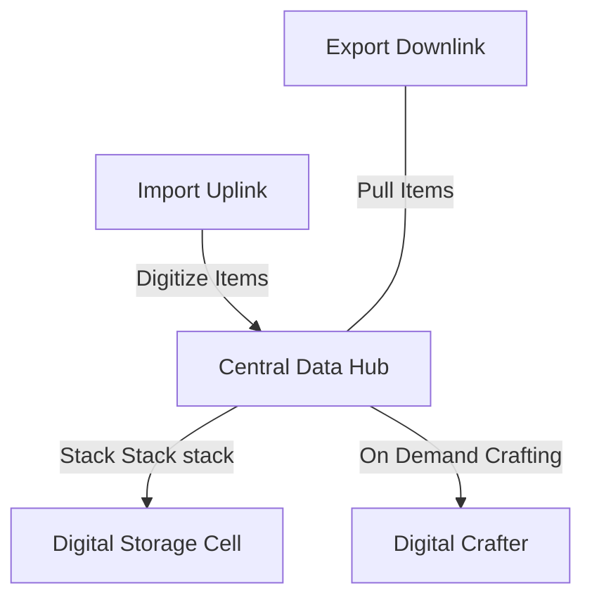

# ROOT.WORKS - Game Wiki & Engineering Manual

Welcome to the official **ROOT.WORKS Engineering Manual**. This guide covers the advanced gameplay mechanics, logistical networks, digital automation grids, and nuclear/quantum technologies needed to build a maximum-efficiency automated factory.

---

## Table of Contents
1. [Logistics & Fluid Piping](#1-logistics--fluid-piping)
2. [Applied Energistics (AE) Digital Storage Grid](#2-applied-energistics-ae-digital-storage-grid)
3. [Programmable Logic Controllers (PLC) Scripting](#3-programmable-logic-controllers-plc-scripting)
4. [Quantum Entanglement (Q-Routers)](#4-quantum-entanglement-q-routers)
5. [Advanced Reactor Engineering](#5-advanced-reactor-engineering)

---

## 1. Logistics & Fluid Piping

ROOT.WORKS features highly specialized conduit types. Mixing incompatible fluids or piping them into the wrong networks will lead to structural blockages or process failures.

### Conduit Registry

| Conduit Type | Compatible Resource | Behavior & Notes |
| :--- | :--- | :--- |
| **Solid Item Pipe** | Ores, Ingots, Components | Basic automated item routing. |
| **Copper & Silver Pipe** | Water, Isotopes | Primary coolant loop and fission reactant transit. |
| **Iron Pipe** | Molten Lava | Thermally shielded for extreme temperatures. |
| **Brass Pipe** | Steam | High-pressure gas flow. |
| **Glass Pipe** | Gases (Oxygen, Hydrogen, etc.) | Pressurized containment. |
| **Lead Lined Pipe** | Chemical Acids | Corrosion-proof routing. |
| **Steel Pipe** | Oils & Plastics | Heavy hydrocarbon transport. |
| **Insulated Pipe** | Cryogenics (Liquid Nitrogen) | Sub-zero temperature routing. |
| **Gold-Lead Pipe** | Radioactive Nuclear Waste | Radiation-shielded hazard containment. |
| **Wires & Cables** | Electricity / CDH Data | Transmits power and networks logic nodes together. |

### Filter Interfaces
Several machines (e.g., Splitters, Filter Pipes, Storage Boxes, Liquid Tanks) support granular filtering:
* **Orange Box**: Restricts primary output channel 1.
* **Blue Box**: Restricts secondary output channel 2 (Splitters only).
* **Whitelist/Blacklist**: Toggles whether specified items are exclusively permitted or blocked.

---

## 2. Applied Energistics (AE) Digital Storage Grid

The Digital Storage system decouples physical storage boxes from your automation lines by digitizing all inventory into a unified network.



### Grid Infrastructure
* **Central Data Hub (CDH)**: The heart of your digital network. Monitors all connected nodes and handles routing. Requires constant electrical power (20 kW minimum).
* **Digital Storage Cells**: Custom storage cells which digitize up to 5,000 items. Manual insertion is disabled; items must be pushed into the network via **Import Uplinks**.
* **Export Downlinks**: Configured with a filter, these continuously extract items from the digital grid back into physical pipes or chests.
* **Digital Crafter**: Automates production by matching registered recipes with requested items. Uses **Pattern Settings** (configured in the terminal UI) to define input ingredients and output results.

---

## 3. Programmable Logic Controllers (PLC) Scripting

Automate your factory gates dynamically by writing scripts in the **PLC Coding Terminal**. The PLC compiles code into an Abstract Syntax Tree (AST) and ticks every frame.

### Channel Mappings & Node Registers
By utilizing **GP (General Purpose) Input/Output** nodes and **PGP (Physical GP)** nodes connected to the Quartz network, your PLC code can read and write parameters:

* **GP Input Node**: Reads a target item count or logic state from the grid and broadcasts it to a PLC channel.
* **GP Output Node**: Receives a value from a PLC channel and pushes it to a network receiver.
* **PGP Nodes**: Probe adjacent physical machines to toggle their states (e.g., turning off a fission reactor core when heat thresholds are breached).

### PLC Language Syntax Guide

```pascal
// Example: Reactor Safety Cutoff
READ heat = GP_IN(1)     // Read temperature from GP Input (Channel 1)
READ water = GP_IN(2)    // Read water level from GP Input (Channel 2)

IF heat > 9000 OR water < 10 THEN
    WRITE 0 -> GP_OUT(1) // Output SHUTDOWN signal to PGP Output (Reactor Gate)
ELSE
    WRITE 1 -> GP_OUT(1) // Keep reactor running safely!
END
```

---

## 4. Quantum Entanglement (Q-Routers)

**Q-Routers** bypass normal physical pipe networks, instantly teleporting items, power, and materials across the map using quantum entanglement.

```text
  [ Q-Router A ] <================ (Quantum Entanglement) ================> [ Q-Router B ]
(Input: 200k kJ charge)                                                    (Output: Instant Teleport)
```

### Entangling Procedure
1. Craft an **Entangled Pair**.
2. Open **Q-Router A** and click **Initiate Link**.
3. Open **Q-Router B** (within range) and click **Complete Link**.
4. Teleporting consumes a baseline charge of **200,000 kJ** per transfer, and draining **60k/s** is required to sustain the entanglement stability.

### Quantum Decoherence Warning
> [!CAUTION]
> If a linked Q-Router is mined, destroyed, or runs completely out of power, its entangled partner will suffer a **Quantum Decoherence Cascade**. This triggers localized energy discharges and clears the entangled inventories of all connected QE Forges.

---

## 5. Advanced Reactor Engineering

Balanced energy production is key to scaling your automation lines to high-tier compute modules.

### Fission Reactors
* **Fuel**: Requires a steady intake of Water and Graphite Rods.
* **Heat Management**: Heat scales with operational activity. If internal temperature reaches **10,000**, the core will melt down! Keep the core cooled using water loops, or automate a PLC safety gate using a GP Input node measuring core temperature.

### Annihilation Reactors
* **Ontological Stability**: Harnesses matter-antimatter collisions. Requires precise control of antiproton magnetic pipes.
* **Stability Slider**: Keep the Ontological Stability index balanced. High-frequency deviations drop output efficiency and damage surrounding logistics grids.
